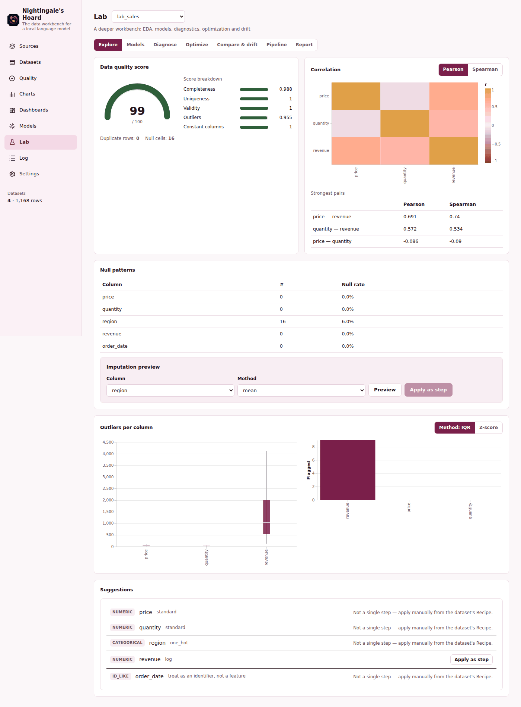
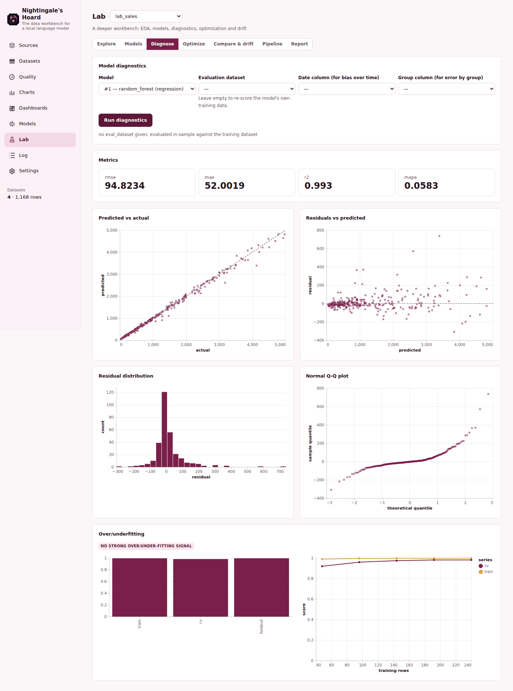

# Nightingale's Hoard

El banco de trabajo de datos para un modelo de lenguaje local: ingesta un archivo desordenado,
límpialo con pasos versionados que puedes deshacer, compruébalo contra reglas que tú defines,
represéntalo en gráficos y paneles, entrena un modelo rápido, y pregúntale algo — todo en tu propio
equipo, y todo alcanzable por un asistente mediante MCP exactamente como lo usarías tú mismo.

Todo se queda en local: DuckDB para los datos, SQLite para los metadatos (fuentes, versiones,
reglas de calidad, gráficos, paneles, modelos, el registro de análisis), sin cuentas, sin llamadas
de red salvo a una URL de archivo que tú le hayas dado.

Forma parte de la familia Hoard (ver `faustus-plugin.json`) — donde Laplace's Hoard es un motor de
consulta de solo lectura, Nightingale es el banco de trabajo: es donde los datos realmente se
construyen y cambian.

## Por qué existe

Limpiar un conjunto de datos real es normalmente un viaje sin vuelta atrás: sobrescribes el
archivo, o guardas cinco copias a medio nombrar "por si acaso". Nightingale hace el viaje
reversible. Cada paso de limpieza — filtrar, renombrar, convertir un tipo, rellenar un nulo,
derivar una columna, unir dos conjuntos de datos, veintiún tipos en total — crea una versión nueva,
real y materializada. Deshacer es instantáneo. Un paso que no te ha gustado nunca toca la versión
anterior. Y si el *archivo de origen* cambia más tarde, "actualizar" lo vuelve a ingerir y reproduce
toda tu receta sobre los datos nuevos automáticamente, deteniéndose limpiamente si un paso ya no
aplica.

## Qué está implementado

| Función | Qué hace | Límites |
| --- | --- | --- |
| **Ingesta** | CSV/TSV (incl. formatos españoles con separador punto y coma y coma decimal), Excel, Parquet, JSON/NDJSON, SQLite, un patrón de carpeta, una URL, o texto pegado. | Una ingesta se ejecuta en un hilo en segundo plano con un límite de 5 minutos; los archivos muy grandes deberían ser Parquet o CSV pre-filtrado en lugar de un libro Excel de 50 hojas. Ingerir con un nombre que ya existe se rechaza (y el conjunto existente no se toca): usa refresh para recargarlo o elige otro nombre. |
| **Transformar** | 21 tipos de paso (filter, select, drop, rename, cast, fill_null, drop_duplicates, derive, split_column, operaciones de texto, replace, bin, date_parts, group, pivot, unpivot, join, union, sort, sample, window, SQL en crudo) — todos previsualizables antes de aplicarse. | El paso `sql` y la herramienta de consulta SQL aceptan exactamente una sentencia de solo lectura; sin escrituras, sin scripts multi-sentencia. |
| **Deshacer / rehacer / receta** | Cada versión es una tabla real; un panel lateral muestra la receta completa, la exporta como un script SQL ejecutable, y puede reproducirla contra datos de origen reingeridos. | Ramificar tras un deshacer descarta las versiones rehechas hacia adelante (como el deshacer de cualquier editor) — hay una sola línea temporal, no un árbol. |
| **Reglas de calidad** | 9 tipos de regla (not_null, unique, accepted_values, range, regex, row_count, freshness, integridad referencial, SQL personalizado), ejecutadas bajo demanda, con historial de aprobado/fallido. Una regla `unique` fallida dice cuántos valores se repiten, cuántas filas son copias sobrantes y cuántas quedarían al quitar duplicados. | Las reglas comprueban la versión *actual* del conjunto de datos; no se ejecutan automáticamente al ingerir salvo que las vuelvas a ejecutar tú mismo. |
| **Gráficos y paneles** | 11 tipos de gráfico, agregados en SQL (nunca se trae una tabla completa al cliente), representados de forma interactiva (Vega-Lite) y como PNG (para exportar/uso del asistente); los paneles combinan gráficos guardados con casillas KPI de expresión SQL. | Los gráficos leen la versión actual del conjunto de datos en el momento de representarse — un gráfico no congela datos pasados, refleja la última limpieza. |
| **Paneles como código** | Un panel como un archivo YAML sencillo sobre una capa semántica reutilizable (métricas y dimensiones con nombre por conjunto de datos) — filtros, pestañas, filas de casillas de métrica/gráfico/tabla/texto, bucles `for` sobre los N valores principales de una dimensión, condiciones `if`, y métricas derivadas (p. ej. una métrica desplazada un mes atrás). Validado con una pista (`hint`) por cada problema, representado con el SQL y el error de cada casilla por separado (una casilla rota nunca rompe el resto), con un historial de 20 versiones con diffs, y exportable a los paneles basados en elementos de arriba. Ver `docs/DASHBOARDS_AS_CODE.md`. | Todo se compila a SQL de solo lectura sobre la vista propia de un conjunto de datos, el mismo nivel de confianza que el filtro de un gráfico. |
| **Modelos** | Aprendizaje supervisado (detección automática de tarea, validación cruzada, importancia de variables, matriz de confusión), agrupamiento k-means (codo + silueta), PCA, detección de anomalías por bosque de aislamiento, previsión Holt-Winters con intervalo y una alternativa estacional-ingenua documentada. Las predicciones/etiquetas/marcas/previsiones van por defecto a un conjunto de datos nuevo (`<origen>__model_<id>`, etc.) — el conjunto de datos de origen, y el tipo de cada una de sus columnas existentes, nunca se toca; `write_to="new_version"` permite optar por escribir sobre el propio origen, y aun así solo añade una columna. | El entrenamiento reduce la muestra a 200.000 filas; la selección automática de variables excluye columnas de tipo identificador casi únicas (se informa de ello) para evitar una explosión de codificación one-hot — pasa una lista explícita de variables para anularlo. |
| **Eliminar un conjunto de datos** | Elimina un conjunto de datos, todas sus versiones, y en cascada sus reglas de calidad, gráficos y modelos; un panel que usaba uno de esos gráficos sigue funcionando (muestra el elemento como no disponible) en lugar de romperse. Disponible desde la pantalla de Datasets (con un diálogo de confirmación que lista lo que depende de él), `DELETE /api/datasets/{name}` (`?force=true` para saltarse las dependencias), y la acción `action="delete"` de la herramienta MCP `data_ingest`. | Se bloquea por defecto si hay gráficos/paneles/modelos que dependen del conjunto de datos — pasa `force`/`force=true` para eliminarlo de todos modos. |
| **Registro de análisis** | Cada operación (ingesta, transformación, ejecución de calidad, gráfico, modelo, exportación...) recibe un id como `N-000123`, con la entrada, un resumen de una línea, el tiempo empleado, y si vino de ti o del asistente. | El registro es de solo-añadir y tiene un límite de tamaño por campo; es un rastro de auditoría, no una copia de seguridad completa de los datos. |
| **Pregunta a tus datos** | Una pregunta en lenguaje llano se convierte en una consulta SQL (que se muestra, no se oculta) ejecutada a través de un modelo de lenguaje local compartido vía Hoard Link. | Necesita un backend de LLM resuelto (Faustus, un servidor llama.cpp local, Ollama, o un endpoint compatible con OpenAI) — sin ninguno configurado lo dice claramente en lugar de inventar. |
| **Lab** | Ciencia de datos más profunda sobre el workbench, con su propia página (siete pestañas — Explorar, Modelos, Diagnosticar, Optimizar, Comparar y desviación, Canalización, Informe): EDA completo (correlación, patrones de nulos + vista previa de imputación, valores atípicos IQR/z-score, sugerencias de codificación con aplicación de un clic como paso) y una puntuación de calidad de 0 a 100; un registro de modelos conectable (lineal/ridge/logística, random forest, gradient boosting, extra trees, k-NN, MLP, proceso gaussiano, más XGBoost/LightGBM si están instalados) con modelos versionados y persistidos; diagnóstico de modelos (residuos, predicho-vs-real, error por grupo, sesgo en el tiempo, sobre/subajuste, calibración); ajuste de hiperparámetros (Optuna TPE o una alternativa aleatoria); explicaciones (SHAP o importancia por permutación + dependencia parcial); optimización bayesiana de las variables de entrada de un modelo (sustituto GP + EI/UCB) y frentes de Pareto multiobjetivo; detección de deriva y comparación de curvas/series entre conjuntos de datos; un informe en PDF; y un editor de canalización visual (añadir/reordenar/editar/previsualizar pasos como una cadena de nodos, aplicados a través del mismo motor de pasos que la página Datasets). Ver `docs/LAB.md`. Datasets y Modelos enlazan directamente con ella ("Abrir en Lab" / "Abrir en el registro de Lab"). | XGBoost/LightGBM/Optuna/SHAP son opcionales (`requirements-lab.txt`) — cada función degrada a una alternativa documentada sin ellos. |

La cuadrícula de datos formatea cada celda según el tipo de columna de DuckDB y el idioma de la
interfaz — las fechas y marcas de tiempo se muestran como fechas (una marca de tiempo exactamente a
medianoche omite la hora), y los números llevan separador de miles y una precisión razonable (2
decimales para columnas `DECIMAL`, hasta 4 cifras significativas para el resto de tipos numéricos)
— mientras que el valor exacto sin formatear queda a un pase del ratón (una descripción emergente) y
a un doble clic (lo copia al portapapeles).

### Lab, en la interfaz

 

## Casos de uso

- Suelta un CSV desordenado que te mandó un compañero, observa cómo el banco de trabajo adivina
  tipos y codificaciones, límpialo con unos cuantos pasos, y exporta algo que de verdad le
  entregarías a alguien.
- Pide a un asistente que "mire estos datos y te diga qué falla" — puede perfilar, ejecutar
  comprobaciones de calidad, y citar la entrada exacta `N-000123` del registro de lo que encontró.
- Mantén una receta contra un archivo de origen que se actualiza cada semana: actualizar vuelve a
  aplicar todos los pasos a los datos nuevos en una sola llamada.
- Entrena un modelo la misma tarde sobre un conjunto de datos que acabas de terminar de limpiar,
  sin salir de la aplicación ni escribir un cuaderno.

## Puesta en marcha

Requiere Python 3.11+ y Node 22+ (Node solo para construir el cliente).

```bash
git clone <este repositorio> nightingale-hoard
cd nightingale-hoard
python -m venv venv
venv/bin/pip install -r requirements.txt      # Windows: venv\Scripts\pip install -r requirements.txt
venv/bin/pip install -r requirements-lab.txt  # opcional: Optuna/SHAP/XGBoost/LightGBM para el paquete Lab
npm install
npm run build
venv/bin/python -m nightingale --demo         # Windows: venv\Scripts\python -m nightingale --demo
```

Abre http://127.0.0.1:5189. `--demo` siembra tres conjuntos de datos inventados (un CSV de ventas
con formato español desordenado, una tabla de clientes, una serie temporal de sensor estacional con
algunas anomalías inyectadas) en una carpeta `data-demo/` separada, así que nunca toca datos reales.
Quita `--demo` para un banco de trabajo limpio.

- `python scripts/launch.py` arranca la aplicación en un puerto libre y abre el navegador.
- `python scripts/dev.py` ejecuta uvicorn con `--reload` más el servidor de desarrollo de Vite
  (haciendo proxy de `/api`).

## Configuración (variables de entorno)

| Variable | Por defecto | Significado |
| --- | --- | --- |
| `NIGHTINGALE_PORT` / `PORT` | `5189` | Puerto preferido; `PORT_STRICT=1` lo fija, si no se toma el primer puerto libre a partir de ahí. |
| `NIGHTINGALE_DATA_DIR` | `<repo>/data` (`data-demo` con `--demo`) | Archivo DuckDB, SQLite de metadatos, `mcp-token`, exportaciones, imágenes de gráficos. |
| `NIGHTINGALE_ALLOWED_HOSTS` | | Nombres de host adicionales aceptados detrás de un túnel (ver abajo). |

### Acceso desde tu móvil (detrás de un túnel)

El servidor se vincula a `127.0.0.1` y solo responde a peticiones cuyo `Host` sea `localhost`,
`127.0.0.1` o `[::1]`. Para alcanzarlo desde tu móvil a través de un túnel, lista los nombres de
host adicionales en `NIGHTINGALE_ALLOWED_HOSTS`, separados por comas, nombres exactos o `*.sufijo`:
`NIGHTINGALE_ALLOWED_HOSTS=mi-pc.ejemplo,*.ts.net`. El puerto y las mayúsculas se ignoran, y el
`Origin` de las llamadas a la API también debe resolver a uno de esos hosts. Una vez abierto a
través del túnel, el navegador ofrece instalarlo como PWA.

## Conectar con Faustus

Suelta `faustus-plugin.json` en Faustus (o apúntalo a este repositorio) y recoge automáticamente
la comprobación de salud, el comando de lanzamiento, y el puente MCP — sin cableado manual. El
plugin nunca abre la base de datos por sí mismo; solo habla con la API HTTP de la aplicación en
ejecución, igual que hace la interfaz del navegador.

## API

Todo JSON; los errores son `{ "error": "..." }`.

- `GET /api/health`, `GET /api/status`
- `GET /api/sources`, `POST /api/sources/ingest`
- `GET /api/datasets`, `POST /api/datasets/{name}/refresh`, `DELETE /api/datasets/{name}`, `GET /api/datasets/{name}/dependents`
- `GET /api/datasets/{name}/{profile,preview,lineage,recipe,correlation}`
- `POST /api/datasets/{name}/{transform,undo,redo,join-preview}`
- `POST /api/query`
- `GET/POST /api/datasets/{name}/quality`, `POST /api/datasets/{name}/quality/run`, `DELETE /api/quality/{id}`
- `GET/POST /api/charts`, `GET/DELETE /api/charts/{id}`
- `GET/POST /api/dashboards`, `GET /api/dashboards/{id}`, `POST /api/dashboards/{id}/items`
- `GET/PUT /api/dac/semantic`, `POST /api/dac/semantic/validate`, `GET /api/dac/semantic/suggest?dataset=`
- `GET/POST /api/dac/dashboards`, `GET/PUT/DELETE /api/dac/dashboards/{slug}`, `POST /api/dac/dashboards/{slug}/{rename,validate,render,export}`, `GET /api/dac/dashboards/{slug}/{history,diff}`, `POST /api/dac/dashboards/import` — ver `docs/DASHBOARDS_AS_CODE.md`
- `POST /api/models/{train,cluster,pca,anomaly,forecast}`, `GET /api/models`
- `POST /api/export`
- `GET /api/log`, `GET /api/log/{id}`
- `POST /api/ask`, `GET /api/ask/available`
- `GET /api/agent/tools` (catálogo + instrucciones), `POST /api/agent/call` (token Bearer desde `<DATA_DIR>/mcp-token`)

## Herramientas MCP

Consulta `docs/MCP.md` para la referencia completa (18 herramientas, de `data_ingest` a
`data_ask`) y un recorrido mínimo. Las instrucciones incluidas indican al asistente que previsualice
una transformación antes de aplicarla cuando el efecto no sea obviamente seguro, que nunca asuma el
nombre de un conjunto de datos (`data_list` primero), y que cite el id del registro de análisis
(`N-000123`) al informar de un resultado.

## Pruebas

```bash
venv/bin/python -m pytest -q     # Windows: venv\Scripts\python -m pytest -q
```

127 pruebas que cubren el motor del banco de trabajo (cada vía de ingesta, cada paso de
transformación, versionado y deshacer/rehacer/reproducción), reglas de calidad, gráficos y paneles,
modelos (incluida la exclusión de columnas de tipo identificador, la corrección de previsión con
marcas de tiempo duplicadas, y la salida por defecto a un conjunto de datos nuevo frente a la opción
`write_to="new_version"` que conserva los tipos), la eliminación de conjuntos de datos (comprobación
de dependencias, cascada, forzado), la API HTTP, las herramientas del agente a través de
`/api/agent/call`, la protección de peticiones, los puntos finales de la PWA, y una prueba de
extremo a extremo en subproceso a través del puente MCP por stdio.

## Licencia

MIT — Luis María Salete Cuartero.
